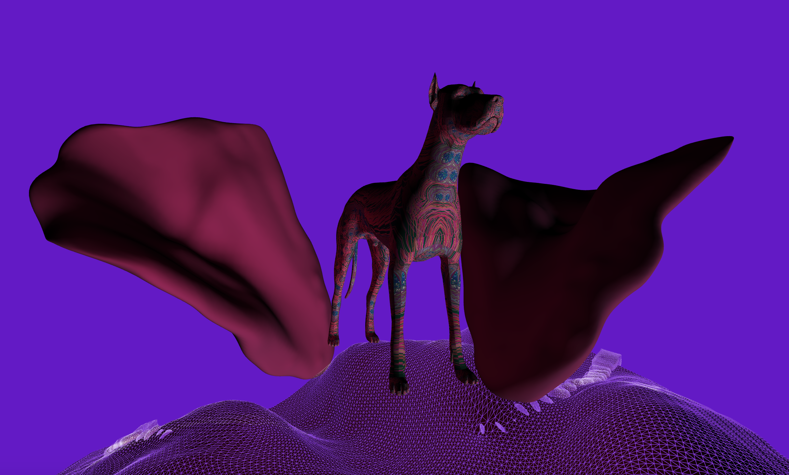
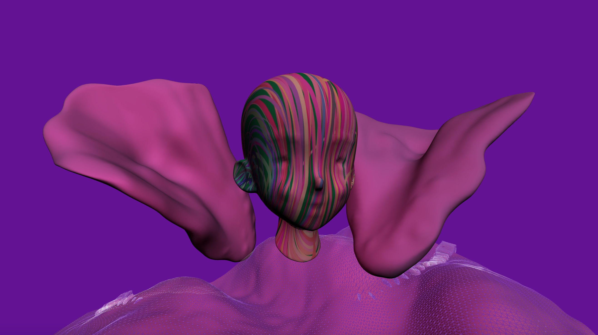

# Wepping
## Projection Mapping on the Web

All animals and people have own colors and personalities, even though they look similar each other some parts. The same shape of a dog or human’s face will be given, but each viewer can make own patterns and the direction of light at the same time.
Also, because of the pandemic, people rarely go outside and enjoy artworks. Rather, viewers are able to enjoy doing projection mapping by themselves on this web page by triggering with the mouse.

**Click here to play**
[Wepping](https://jtao7.github.io/p5.js_3dproject/)
